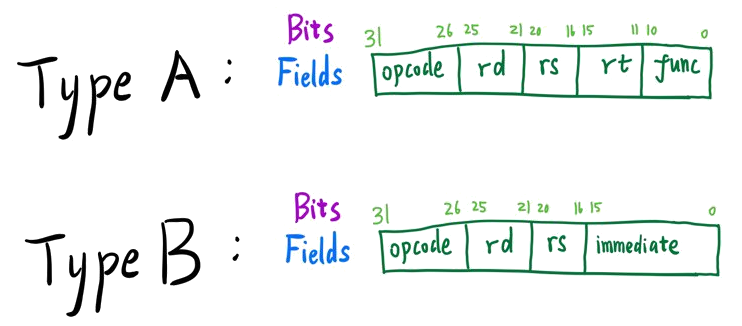

# NECPU

This is a simple CPU design written in Verilog for EE2026 Project. It is based on [Basic CPU](https://alchitry.com/blogs/tutorials/basic-cpu).

This design is made for the [Sipeed Tang Nano FPGA board](https://www.seeedstudio.com/Sipeed-Tang-Nano-FPGA-board-powered-by-GW1N-1-FPGA-p-4304.html) (more information about the board can be found [here](https://lirc572.github.io/2019/12/23/Sipeed-Tang-Nano-Development-Environment-Setup/)), created on the [Gowin IDE](http://www.gowinsemi.com.cn/faq.aspx). However, it should be easy to port the code to any other FPGA board/chip.

## Why The Name NECPU

When I created this repo, I just opened a bottle of Nutri-Express, thus came up with this name.

## Simulation

https://www.edaplayground.com/x/4RjK

## Description

The **NECPU** is a 32-bit general purpose register architecture processor with the specifications below. Registers `$rs`, `$rt`, and `$rd` are placeholders for actual general purpose registers `$0`, `$1`, `$2`, ..., `$31`, each holding a 32-bit value. `immediate` refers to an immediate value (constant) and `label` refers to label in the instruction corresponding to a specific line in the code. All *immediates* are given as 16-bit unsigned values. Whenever an *immediate* is used as an operand with a register as the other operand, the *immediate* is zero-extended to 32-bit before computation. All *labels* will be converted into actual addresses using direct addressing mode.

**NECPU** can accomodate up to 4294967296 (2^32) addressable memory where each memory location holds 4 bytes (32 bits). **NECPU** is word (4 bytes) addressable. (It is not byte addressable!)

Every instruction of **NECPU** takes exactly one clock cycle to complete. Hence, the time taken of a code snippet can easily be calculated.

## Instruction Set

We will use the following convension to simplify our description:

- Given a register `$r`, the content of the register `$r` is given as `R[$r]`.
- Given a memory location `addr`, the content at the memory location `addr` is `M[addr]`.
- `PC` is the program counter which is a special register that holds the address of the instruction currently being executed.

Instruction Format             | Name                 | Operation
------------------------------ | -------------------- | ----------------------------------
NOP                            | No-Op                | Do nothing
LW   `$rd`, `$rs`, `immediate` | Load Word            | `R[$rd]` = `M[R[$rs] + immediate]`
SW   `$rd`, `$rs`, `immediate` | Store Word           | `M[R[$rs] + immediate]` = `R[$rd]`
LLI  `$rd`, `immediate`        | Load Lower Immediate | `R[$rd][15:0]` = `immediate`
LUI  `$rd`, `immediate`        | Load Upper Immediate | `R[$rd][31:16]` = `immediate`
SLT  `$rd`, `$rs`, `$rt`       | Set Less Than        | `R[$rd]` = `R[$rs]` <  `R[$rt]`
SEQ  `$rd`, `$rs`, `$rt`       | Set Equal            | `R[$rd]` = `R[$rs]` == `R[$rt]`
BEQ  `$rd`, `immediate`        | Branch On Equal      | `PC` = `PC` + (`R[$rd]` == `immediate` ? 2 : 1)
BNE  `$rd`, `immediate`        | Branch On Not Equal  | `PC` = `PC` + (`R[$rd]` != `immediate` ? 2 : 1)
ADD  `$rd`, `$rs`, `$rt`       | Add                  | `R[$rd]` = `R[$rs]` + `R[$rt]`
ADDi `$rd`, `$rs`, `immediate` | Add immediate        | `R[$rd]` = `R[$rs]` + `immediate`
SUB  `$rd`, `$rs`, `$rt`       | Subtract             | `R[$rd]` = `R[$rs]` - `R[$rt]`
SUBi `$rd`, `$rs`, `immediate` | Subtract Immediate   | `R[$rd]` = `R[$rs]` - `immediate`
SLL  `$rd`, `$rs`, `$rt`       | Shift Left Logical   | `R[$rd]` = `R[$rs]` << `R[$rt]`
SRL  `$rd`, `$rs`, `$rt`       | Shift Right Logical  | `R[$rd]` = `R[$rs]` >> `R[$rt]`
AND  `$rd`, `$rs`, `$rt`       | And                  | `R[$rd]` = `R[$rs]` & `R[$rt]`
ANDi `$rd`, `$rs`, `immediate` | And Immediate        | `R[$rd]` = `R[$rs]` & `immediate`
OR   `$rd`, `$rs`, `$rt`       | Or                   | `R[$rd]` = `R[$rs]` | `R[$rt]`
ORi  `$rd`, `$rs`, `immediate` | Or Immediate         | `R[$rd]` = `R[$rs]` | `immediate`
INV  `$rd`, `$rs`              | Invert               | `R[$rd]` = ~ `R[$rs]`
XOR  `$rd`, `$rs`, `$rt`       | Xor                  | `R[$rd]` = `R[$rs]` ^ `R[$rt]`
XORi `$rd`, `$rs`, `immediate` | Xor Immediate        | `R[$rd]` = `R[$rs]` ^ `immediate`
JMP  `$rd`                     | Unconditional Jump   | `PC` = `R[$rd]`

## Instruction Encoding

- Type A
  - SLT
  - SEQ
  - ADD
  - SUB
  - SLL
  - SRL
  - AND
  - OR
  - INV (`$rt` ignored)
  - XOR
- Type B
  - LW
  - SW
  - LLI (`$rs` ignored)
  - LUI (`$rs` ignored)
  - BEQ (`$rs` ignored)
  - BNE (`$rs` ignored)
  - ADDi
  - SUBi
  - ANDi
  - ORi
  - XORi
  - JMP (can also put under type A since only `$rd` is used)

Note that the `BEQ` and `BNE` instructions of **NECPU** differ from those of **MIPS**:

- **NECPU**'s `BEQ` and `BNE` instructions compare a register's value with an `immediate`, while **MIPS** compares the values of two registers.
- **NECPU**'s `BEQ` and `BNE` instructions can only skip the next **one** instruction if the condition is satisfied.

## TODO

- Write testbenches for all instructions
- Extract Instruction memory out of the CPU module
- Port to Vivado/Xilinx Artix-7
- More detailed documentation

